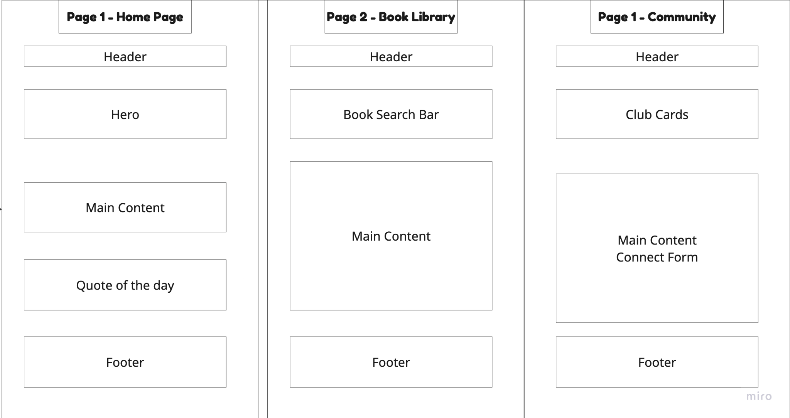

# PageTurner — Book Lovers' Discovery Portal

**Live Site:** https://bookpageturner.netlify.app/

---

## Project Pitch

PageTurner is a web portal for avid readers who want a calm, distraction-free place to discover books, find their next read by genre, get daily literary inspiration, and connect with a local book club community — without the noise and algorithm-driven clutter of platforms like Amazon or Goodreads.

---

## User Persona

**Target User:** Regular readers, ages 20–35

| Attribute      | Detail                                                                         |
| -------------- | ------------------------------------------------------------------------------ |
| Name           | Priya, 28 — graduate student and remote worker                                 |
| Reading habits | Reads 2–3 books per month, discovers books through word-of-mouth               |
| Tech comfort   | Moderate — uses apps daily, not a developer                                    |
| Goal           | Find well-curated book recommendations filtered by mood and genre              |
| Pain Point     | Amazon feels overwhelming; Goodreads is cluttered with ads and social pressure |

---

## Problem Statement

Book lovers spend more time searching for their next book than actually reading. Existing platforms are noisy, algorithm-driven, or socially exhausting. PageTurner solves this by offering a focused, curated portal with a handpicked book gallery filterable by genre, a daily quote pulled live from an external API, and an easy form to join a local book club community.

---

## Application Structure

PageTurner is built across three distinct HTML pages:

**Home (`index.html`)**
Hero section with a headline and call-to-action. Three hand-picked staff pick book cards. A live "Quote of the Day" widget that fetches a literary quote from the API Ninjas Quotes API on each page load, with a button to fetch a new quote without reloading the page.

**Library (`library.html`)**
Full book gallery of eight books rendered dynamically from a local JavaScript array. Real-time search input filters cards by title or author as the user types. Genre filter tabs (All, Fiction, Non-Fiction, Mystery, Sci-Fi, Biography) work simultaneously with the search input. An empty state message displays when no results match.

**Community (`community.html`)**
Book club information and meeting schedule. A join form with four fields — full name, email, preferred genre, and a message — validated entirely through custom JavaScript rules. Errors appear inline per field on blur and again on submit. On success, the form is replaced with a confirmation message.

---

## Technical Implementation

**Technologies**

- HTML5 with semantic elements (`header`, `nav`, `main`, `section`, `article`, `footer`)
- CSS3 with custom properties (variables), Flexbox, CSS Grid, and mobile-first media queries
- Vanilla JavaScript (ES6+) — no frameworks or third-party libraries
- Fetch API for asynchronous data retrieval
- No build tools required — runs directly in the browser

**Project Structure**

```
pageturner/
├── index.html
├── library.html
├── community.html
├── css/
│   └── style.css
├── js/
│   ├── nav.js          — active nav state across all pages
│   ├── widget.js       — fetch() call to API Ninjas, loading state, error fallback
│   ├── gallery.js      — local book data array, card rendering, search and filter logic
│   └── form.js         — custom client-side validation with inline error messages
├── assets/
│   └── sketch.png
├── README.md
└── NOTES.md
```

**API**

API Ninjas – Quotes API
`https://api.api-ninjas.com/v1/quotes?category=happiness`

Each response includes: `quote`, `author`, and `category`. On network error, the widget falls back to a hardcoded quote so the page never breaks.

---

## Design System

All colors, spacing, and typography are defined as CSS custom properties in `style.css`:

- Primary font: Playfair Display (headings) paired with Source Serif 4 (body)
- Accent color: burnt orange (`#C2410C`) — warm, editorial, and distinct from typical web palettes
- Background: warm off-white (`#FAFAF7`) to avoid the sterile feel of pure white

---

## Responsive Design

The site is built mobile-first. The most complex responsive component is the genre filter on `library.html`, which renders as a horizontally scrollable pill bar on mobile and transforms into a full tab row on desktop — a drastic layout shift handled entirely through CSS Grid and media queries with no JavaScript involved.

---

## Low-Fidelity Sketch



---

## Challenges and Solutions

**Challenge:** The genre filter tabs and the search bar needed to work together simultaneously. Applying one filter should not reset the other, and both needed to update the displayed cards on every change without duplicating render logic.

**Solution:** I stored the active genre selection and the current search string as two separate module-level variables in `gallery.js`. Every time either input changed — a tab click or a keystroke — a single `filterBooks()` function ran and applied both conditions together using a chained `Array.filter()` with an AND condition. This kept all render logic in one place, ensured the two filters always stayed in sync, and avoided any redundant DOM updates.

---

## How to Run Locally

1. Clone the repository:
   ```bash
   git clone https://github.com/codingwithtashi/page-turner.git
   cd page-turner
   ```
2. Open `index.html` in your browser. No build step or server is required.
3. Add your API Ninjas key to `js/widget.js` where indicated by the comment.

---

## Deployment

Deployed via Netlify with continuous deployment from the main branch on GitHub.

- Live URL: _coming soon_

---

## Acknowledgements

Quote data provided by [API Ninjas](https://api-ninjas.com/api/quotes).

---

Web Development Fundamentals SDBP 038.001
